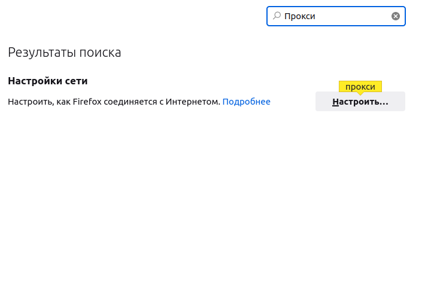
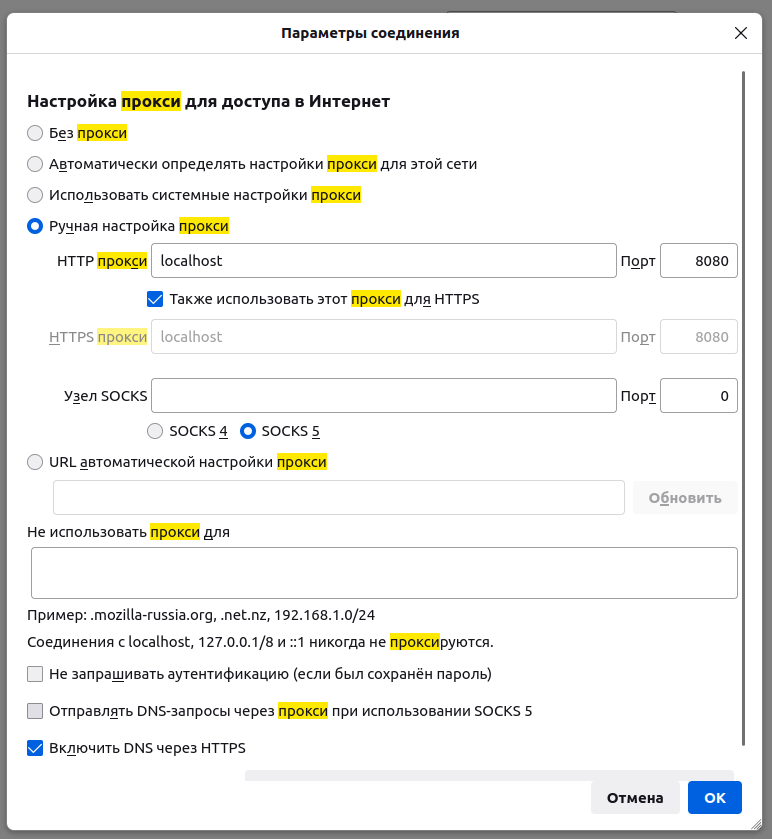
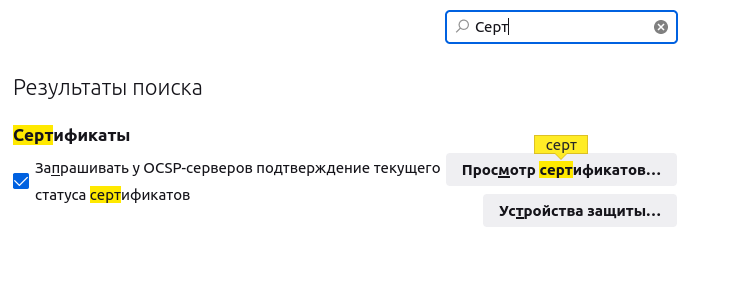
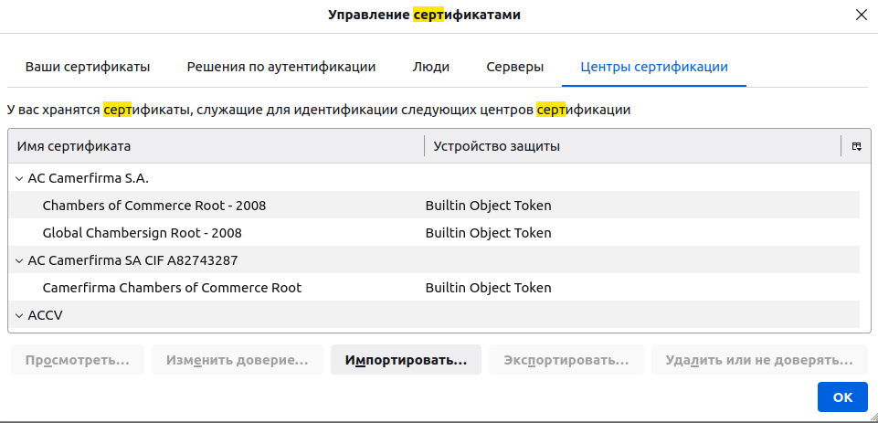

# HW1

## Запуск прокси-сервера с https в Docker с хранением запросов в MongoDB

1) Запустить `sudo docker-compose up`
2) Собрать бинарный файл Go c помощью `make -B build`
3) Запустить `./build/proxy/out`
4) Скопировать сертификаты `sudo cp ~/.mitm/ca-cert.pem /usr/local/share/ca-certificates/ca-cert.crt`
5) Обновить сертификаты `sudo update-ca-certificates`

## Тестовые запросы

Ex: `curl -x http://127.0.0.1:8080 https://mail.ru`

## Запуск сервера для работы с БД

* Запустить `./build/webApi/out`
* Endpoints для работы с базой данных:
  1. `/requests` для отображения списка всех запросов
  2. `/requests/{id}` для отображения запроса по его id
  3. `/repeat/{id}` для отображения ответа сервера

## Настройка прокси браузера (на примере Firefox)

1. В настройках браузера необходимо зайти в настройки прокси (их можно найти через поиск)

   

2. Настраиваем прокси

   

3. В настройках браузера устанавливаем сгенерированные сертификаты

   

4. Устанавливаем сертификаты `ca-cert.pem` из папки `~/.mitm/`

   

5. Очищаем историю браузера (лишь в этом случае не возвращается 304, хотя заголовки в middleware удаляются)

6. Заходим на сервер с БД `http://localhost:8000/requests`
7. Стоит опробовать на сайте `http://example.org`.Ищем его через поиск (можно написать дополнительную middleware, чтобы отображаемые результаты были в формате json, но тогда для более масштабных сайтов сложнее искать нужную страницу, т.к. они совершают много запросов, а в этом случае можно быстро через поиск это сделать)
8. Копируем `id` запроса и переходим по ссылке `http://localhost/repeat/{id}`, на которой выводится ответ сервера
